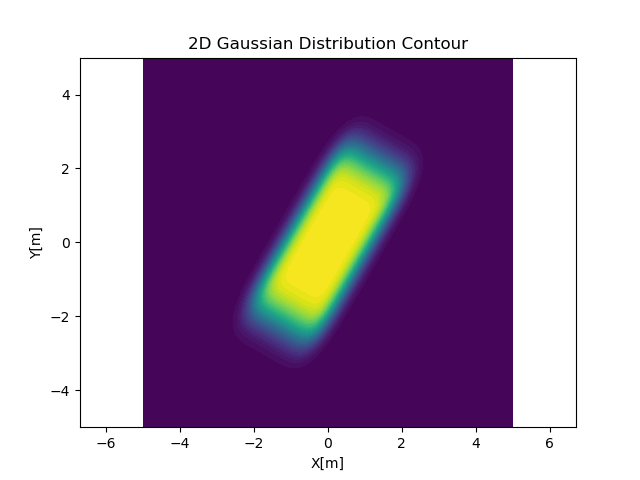

# Probabilistic Rigid Body

なんらかのセンサで認識した矩形物体の確率分布について考えるリポジトリです．

# 使い方

```bash
pip install .

prb show rigid-body --help

# デフォルトパラメータで実行
prb show rigid-body
```



プロファイル（周辺確率）はマウスカーソルの位置に応じて表示されます．

<iframe src="https://giphy.com/embed/MLMFid5OJ5C3vQvSVn" width="480" height="377" frameBorder="0" class="giphy-embed" allowFullScreen></iframe><p><a href="https://giphy.com/gifs/MLMFid5OJ5C3vQvSVn">via GIPHY</a></p>p

